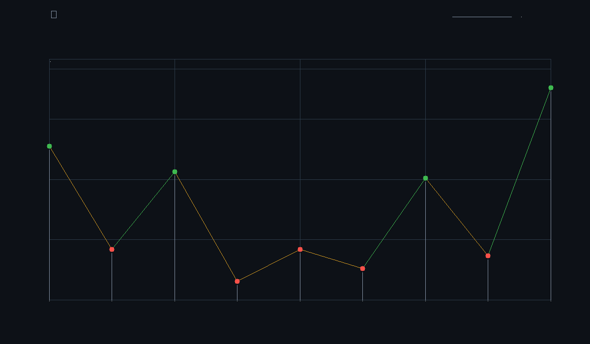
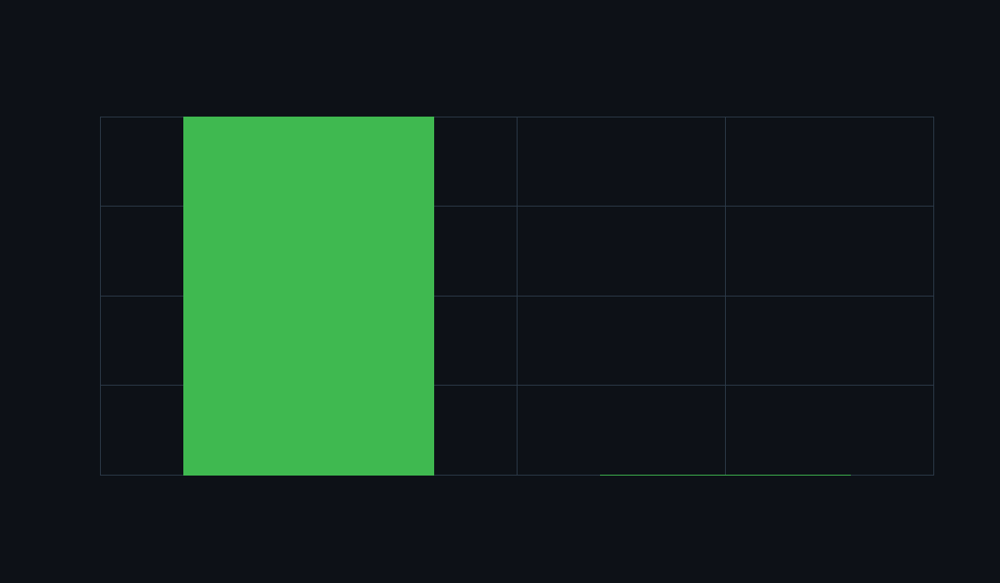

# 0x960 — Self-Improving Chess960 Engine via OpenEnv

**An AI that doesn't play chess. It engineers better chess engines.**

0x960 is an OpenEnv self-improvement environment where an agent learns to act as a Chess960 engine engineer — inspecting, editing, testing, and iterating on engine code in a bounded workspace. The reward signal comes from real downstream match results: the engine either wins more games or it doesn't. No proxy metrics, no shortcuts.

> **Hackathon Track:** Statement 4 — Self-Improvement
> **Stack:** OpenEnv 0.2.1 · HF TRL GRPO · Qwen 3.5 · GPT-5.4 Teacher · ACP Runtime · Codex Swarm
> **Infra:** Local dev + Northflank H100

---

## Why This Matters

Most RL environments for LLMs optimize text completions against a reward model. 0x960 is different — it's a **real multi-step coding task** with downstream evaluation that can't be gamed.

**Why Chess960 (not standard chess):**
Standard chess engines can be improved by memorizing opening books. Chess960 randomizes the starting position across 960 legal setups, so the engine must generalize. You can't hack the reward by memorizing patterns — the agent has to write evaluation code that *actually understands chess positions*. This makes Chess960 a much cleaner robustness test for self-improvement.

**Why bounded engineering (not move prediction):**
The agent doesn't play chess. It *engineers chess engines*. It sees engine source code, writes a bounded replacement, tests it with real matches, and is rewarded only when the engine actually wins more games. This is closer to how humans improve software than anything a text-only reward model can capture.

**The training pipeline that actually worked:**
Base Qwen 3.5-0.8B scored **-2.1 reward** — it never once wrote code. After teacher distillation (GPT-5.4 via [ACP runtime](https://docs.openclaw.ai/tools/acp-agents)) + SFT + TRL GRPO refinement, the same 0.8B model scores **+1.0 reward** and reliably executes the full `write_file → run_match → finish` engineering loop. Combined with the Codex swarm's autonomous engine search, the system pushed from zero to **+596.5 Elo internally** and **competitive with Stockfish 1600** on held-out Chess960 positions. Teacher rollouts ran through ACP across two Codex billing cycles — the trajectory quality was worth every dollar.

**Why this is a real self-improvement loop:**
On top of the RL policy path, we built a fully autonomous **Codex agent swarm** — over a dozen Codex agents across multiple rounds, each with a specialized role (structure, tactics, activity, pawn endgames, initiative), competing in a champion/challenger tournament. A coordinator orchestrates everything: screens every patch on held-out positions, rejects bloated rewrites, promotes only verified winners, and logs the full audit trail. We also scaled up to **Qwen 3.5-9B** with QLoRA GRPO on the Northflank H100 as a larger RL scaling probe alongside the 0.8B distilled student. The swarm runs continuously, discovers stronger engine heuristics on its own, and the system has **two parallel self-improvement loops** feeding the same engine. The reward is grounded in *actual chess strength* — not proxy metrics, not text quality scores, not human preferences. The engine either beats Stockfish or it doesn't.

---

## Results

| Metric | Value |
|--------|-------|
| Engine Elo gain (internal, vs search baseline) | **+596.5** |
| Engine Elo gain (vs Stockfish 1320 anchor) | **+221.1** |
| Estimated local Chess960 strength | **~1600** (low-to-mid) |
| Swarm-accepted eval improvements | **4 champions promoted** |
| SFT student token accuracy | **98.76%** |
| Student reward (base → distilled) | **-2.1 → +1.0** |

<p align="center">
  
  
</p>

---

## How It Works

```
┌─────────────────────────────────────────────────────────┐
│                    0x960 Pipeline                       │
│                                                         │
│  ┌──────────┐    ┌──────────┐    ┌──────────────────┐   │
│  │ Teacher  │───▶│ Student  │───▶│ GRPO Refinement  │   │
│  │ (GPT-5.4)│    │ SFT      │    │ (TRL + OpenEnv)  │   │
│  └──────────┘    └──────────┘    └──────────────────┘   │
│       ↓                                                 │
│  ┌──────────────────────────────────────────────────┐   │
│  │         Codex Swarm (5 specialized workers)      │   │
│  │  Structure · Tactical · Activity · Pawn · Tempo  │   │
│  │         Champion/Challenger Tournament           │   │
│  └──────────────────────────────────────────────────┘   │
│       ↓                                                 │
│  ┌──────────────────────────────────────────────────┐   │
│  │          Benchmark Suite (held-out positions)     │   │
│  │   eval-vs-eval · engine-vs-engine · UCI anchor   │   │
│  │              league self-play · dashboard         │   │
│  └──────────────────────────────────────────────────┘   │
└─────────────────────────────────────────────────────────┘
```

### The Core Insight

Base models fail at self-improvement because they can't discover the right workflow. When we dropped Qwen 3.5 into the environment raw, it never once attempted to write code — it just read files and quit. **Reward: -2.1.**

Our fix: **teacher-student distillation first, RL second.**

1. A strong teacher (GPT-5.4) generates successful trajectories in the bounded environment
2. A small open student (Qwen 3.5-0.8B) learns the `write_file → run_match → finish` workflow via SFT
3. GRPO refines the student once it already knows how to act
4. In parallel, a Codex swarm autonomously searches for stronger engine heuristics

After distillation, the student reliably executes the full engineering loop. **Reward: +1.0.**

---

## GRPO + OpenEnv Training Notes

We ran a Hugging Face TRL GRPO setup over a bounded OpenEnv coding environment rather than a plain text-only reward model. The policy was not optimizing free-form completions in the abstract; it was optimizing structured multi-step tool use over a Chess960 engine-editing task.

Concretely, the agent observed the current `eval.py`, recent action history, remaining budget, and match feedback, then emitted bounded actions like `write_file`, `run_match`, and `finish`. Reward was downstream and environment-grounded: real engine outcomes plus shaping around valid edits, meaningful test cycles, and clean episode completion. The RL objective was therefore closer to long-horizon workflow optimization than standard single-turn preference tuning.

The key lesson from the GRPO runs was that raw RL was not the bottleneck solver by itself because base policies had weak action priors. Small and mid-size base models often failed to discover the core edit loop and instead collapsed into degenerate actions like repeated evaluation calls or premature `finish`.

So the training strategy evolved into a teacher-student stack:

1. collect successful bounded-action trajectories from a stronger coding teacher,
2. SFT/distill a smaller open student onto that workflow,
3. apply GRPO as a refinement stage.

In NLP terms, GRPO became the policy-improvement phase on top of a behaviorally competent initialization, not the mechanism for discovering the task ontology from scratch.

Implementation-wise, the stack uses Hugging Face `transformers` + `trl` GRPO with Qwen 3.5-family models on the student side, including `Qwen/Qwen3.5-0.8B` for the distilled student path and earlier larger-Qwen GRPO experiments as scaling probes. The training entrypoint is one TRL/OpenEnv script with handcrafted, infer, and train modes, so the same environment contract is reused for debugging, rollout inspection, and RL.

We also added heavy observability: rollout logs, parsed action traces, code previews, match scores, and per-step summaries. That made it possible to diagnose the real failure mode: not "reward too low" in the abstract, but "policy never meaningfully edits code, so GRPO is optimizing noise around a bad exploration frontier."

---

## Why Chess960

Standard chess openings are heavily memorized. Chess960 randomizes the back rank across 960 possible starting positions, so the engine must generalize — no opening books, no memorized lines. This makes it a clean robustness test for self-improvement: you can't hack the reward by memorizing positions.

---

## The Bounded Environment

The agent operates in a tightly constrained workspace with five actions:

| Action | What it does |
|--------|-------------|
| `read_file` | Inspect the current eval code |
| `write_file` | Submit a bounded replacement |
| `run_static_eval` | Quick sanity check on a position |
| `run_match` | Full head-to-head match (the real test) |
| `finish` | Declare done — only rewarded if the engine improved |

Invalid writes are rolled back instantly. The reward comes from actual match outcomes on held-out Chess960 positions. The agent can't game the metric — it has to write code that makes the engine play better chess.

---

## Three Self-Improvement Loops

### 1. Policy Learning (Teacher → Student → RL)

The agent learns *how* to engineer. Teacher distillation solves the cold-start problem, SFT teaches the workflow, and GRPO optimizes for real match reward.

### 2. Codex Swarm (Autonomous Engine Search)

Five specialized Codex workers — each targeting different chess knowledge (pawn structure, king safety, piece activity, tactical safety, initiative) — compete in a champion/challenger tournament. Only patches that beat the current champion on held-out benchmarks get promoted. Fully autonomous once launched.

### 3. Classical Engine Upgrades

We pushed the search stack from basic alpha-beta to a competitive engine with PVS, null-move pruning, LMR, aspiration windows, killer moves, transposition tables, and selective depth extensions. **Cumulative gain: +596.5 Elo.**

---

## Training Pipeline

### Teacher Distillation
```sh
uv run python -m train.codex_distill \
  --base-url http://127.0.0.1:8000 \
  --model gpt-5.4 \
  --episodes 20
```

### Student SFT
```sh
uv run python -m train.sft_student \
  --model Qwen/Qwen3.5-0.8B \
  --output-dir outputs/sft_qwen_0p8b
```

### GRPO Refinement (TRL)
```sh
uv run python -m train.minimal_trl_openenv \
  --mode train \
  --base-url http://127.0.0.1:8000 \
  --model Qwen/Qwen3.5-0.8B \
  --steps 20 \
  --num-generations 4
```

### Codex Swarm (Autonomous)
```sh
uv run python -m train.codex_swarm run \
  --workers 5 --rounds 1 \
  --model gpt-5.3-codex \
  --screen-positions 8 --positions 16 \
  --worker-timeout-sec 180 --max-diff-lines 80
```

---

## Benchmarking

We don't trust proxy metrics. Every claim is backed by held-out Chess960 match results.

```sh
# Eval vs eval (same search)
uv run python -m train.benchmark_eval \
  --candidate-file src/zero960/workspace_template/eval.py \
  --baseline-file src/zero960/engine/default_eval.py \
  --positions 64 --depth 2

# Against Stockfish UCI anchor
uv run python -m train.benchmark_uci \
  --candidate-file src/zero960/workspace_template/eval.py \
  --engine-command stockfish \
  --engine-option UCI_LimitStrength=true \
  --engine-option UCI_Elo=1320 \
  --positions 32 --candidate-depth 2 --engine-depth 1

# Full engine vs engine (each side owns its own search + eval)
uv run python -m train.benchmark_engine \
  --candidate-root /tmp/worker \
  --baseline-root . \
  --positions 32 --depth 2

# League self-play against own history
uv run python -m train.benchmark_league \
  --candidate-file outputs/codex_swarm/champion_eval.py \
  --positions 16

# Generate results dashboard
uv run python -m train.build_dashboard --include-stockfish
```

---

## Quick Start

```sh
# Start the OpenEnv server
uv run python -m uvicorn zero960_env.server.app:app --host 127.0.0.1 --port 8000

# Run the bounded-action demo
uv run python -m train.minimal_trl_openenv --mode handcrafted --base-url http://127.0.0.1:8000

# Run a single policy episode
uv run python -m train.minimal_trl_openenv \
  --mode infer \
  --base-url http://127.0.0.1:8000 \
  --model Qwen/Qwen3.5-0.8B
```

---

## Repo Layout

```
src/zero960/           Chess960 engine, workspace, and episode runtime
src/zero960_env/       OpenEnv server, models, and client
train/                 All training and benchmarking entrypoints
  minimal_trl_openenv.py   GRPO training + inference + demo
  codex_distill.py         Teacher rollout collection
  sft_student.py           Student SFT
  codex_swarm.py           Autonomous champion/challenger search
  benchmark_*.py           Eval, engine, UCI, and league benchmarks
  build_dashboard.py       Results dashboard generator
docs/                  Architecture, training, process log
media/submission/      Benchmark charts for submission
outputs/               Swarm champions, dashboard, training artifacts
```

---

## Models & Infrastructure

| Role | Model |
|------|-------|
| Teacher | GPT-5.4 |
| Swarm / outer-loop search | GPT-5.3-Codex |
| Student (trainable) | Qwen/Qwen3.5-0.8B |
| Earlier RL experiments | Qwen/Qwen3.5-9B (QLoRA GRPO) |

| Infra | Purpose |
|-------|---------|
| OpenEnv 0.2.1 | Environment runtime |
| Local dev | Fast iteration loop |
| Northflank H100 | Heavy training + benchmarking |
| HF Spaces | Public environment deployment |

---

## Docs

- [Architecture](docs/architecture.md) — Bounded OpenEnv task design
- [Training](docs/training.md) — Teacher distillation, SFT, GRPO, and engine search paths
- [Codex Swarm Plan](docs/codex-swarm-plan.md) — Autonomous champion/challenger engine search
- [Why Chess960](docs/why_chess960.md) — Why we chose Chess960 over standard chess
- [Demo Script](docs/demo-script.md) — One-minute pitch outline
- [Process Log](docs/process.md) — Full build and benchmark trail
