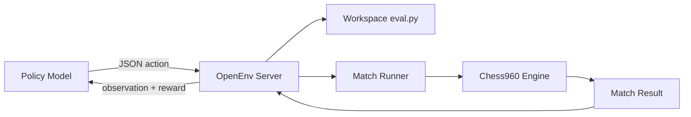
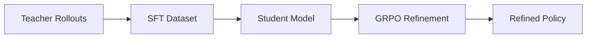
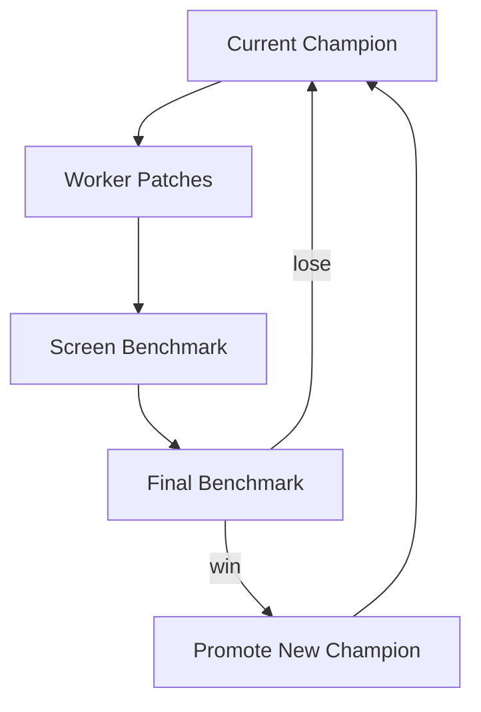

# 0x960: Self-Improving Chess960 Engine with OpenEnv

An AI system that does not play chess directly. It improves a chess engine by editing code, testing, and iterating inside a bounded environment.

## What 0x960 is

0x960 is an OpenEnv task where the policy acts like an engine engineer. Each episode gives the model a constrained workspace and a small set of actions:

- `read_file`
- `write_file`
- `run_static_eval`
- `run_match`
- `finish`

The reward is grounded in downstream match performance on Chess960 positions, not text quality.

## Why this setup matters

Most RL-for-LLMs setups optimize text completions against proxy signals. 0x960 optimizes multi-step tool use with verifiable outcomes:

- code edits must be valid
- changes are tested in matches
- performance is measured on held-out positions
- weak behavior loops are visible in traces and logs

## Results snapshot

| Metric | Value |
|---|---:|
| Internal Elo gain vs baseline | +596.5 |
| Elo gain vs Stockfish 1320 anchor | +221.1 |
| Estimated local strength | ~1600 |
| Distilled student reward shift | -2.1 to +1.0 |
| SFT token accuracy | 98.76% |
| Swarm-promoted champions | 4 |

## Visuals

### Compound improvement


### Reward regime shift


### External anchor positioning


### Behavior quality shift


### Execution velocity timeline


## Training strategy that worked

The core lesson was simple: raw RL alone was not enough at cold start. Base policies often failed to discover the useful action sequence and collapsed into low-value actions.

So the working strategy became:

1. Collect successful teacher trajectories in the bounded action schema.
2. Distill into a smaller student with SFT.
3. Run GRPO refinement once the policy already executes the workflow.
4. In parallel, run autonomous Codex swarm search for engine heuristics.

## Architecture and loops

### System architecture



### Training pipeline



### Champion and challenger engine loop



## Quick start

```bash
# start server
uv run python -m uvicorn zero960_env.server.app:app --host 127.0.0.1 --port 8000

# handcrafted sanity episode
uv run python -m train.minimal_trl_openenv --mode handcrafted --base-url http://127.0.0.1:8000

# single policy episode
uv run python -m train.minimal_trl_openenv \
  --mode infer \
  --base-url http://127.0.0.1:8000 \
  --model Qwen/Qwen3.5-0.8B
```

## Core training commands

```bash
# teacher trajectory collection
uv run python -m train.codex_distill \
  --base-url http://127.0.0.1:8000 \
  --model gpt-5.4 \
  --episodes 20

# student sft
uv run python -m train.sft_student \
  --model Qwen/Qwen3.5-0.8B \
  --output-dir outputs/sft_qwen_0p8b

# grpo refinement
uv run python -m train.minimal_trl_openenv \
  --mode train \
  --base-url http://127.0.0.1:8000 \
  --model Qwen/Qwen3.5-0.8B \
  --steps 20 \
  --num-generations 4
```

## Benchmarking commands

```bash
# eval vs eval
uv run python -m train.benchmark_eval \
  --candidate-file src/zero960/workspace_template/eval.py \
  --baseline-file src/zero960/engine/default_eval.py \
  --positions 64 \
  --depth 2

# uci anchor benchmark
uv run python -m train.benchmark_uci \
  --candidate-file src/zero960/workspace_template/eval.py \
  --engine-command stockfish \
  --engine-option UCI_LimitStrength=true \
  --engine-option UCI_Elo=1320 \
  --positions 32 \
  --candidate-depth 2 \
  --engine-depth 1
```

## Repo layout

- `src/zero960/` engine runtime and workspace logic
- `src/zero960_env/` OpenEnv server, models, client
- `train/` training and benchmark entrypoints
- `figures/` matplotlib figure pack
- `docs/` architecture, training notes, process log
- `media/submission/` submission media assets

## Model and infra stack

- Teacher: GPT-5.4
- Student path: Qwen/Qwen3.5-0.8B
- Scaling probe: Qwen/Qwen3.5-9B (QLoRA experiments)
- Runtime: OpenEnv 0.2.1, TRL GRPO, transformers
- Infra: local development + Northflank H100 + Hugging Face Spaces

## Docs

- [Training deep dive](docs/training.md)
- [Architecture](docs/architecture.md)
- [Why Chess960](docs/why_chess960.md)
- [Demo script](docs/demo-script.md)
- [Process log](docs/process.md)
- [Mermaid diagrams](docs/diagrams/mermaid.md)
