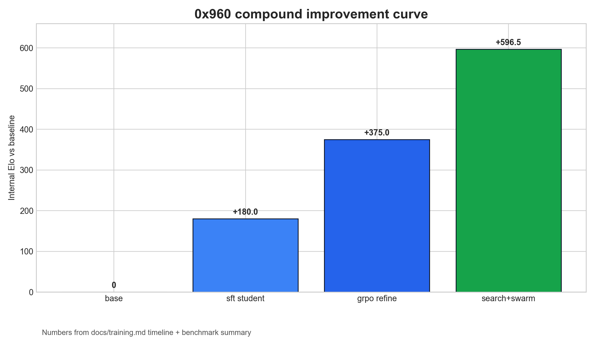
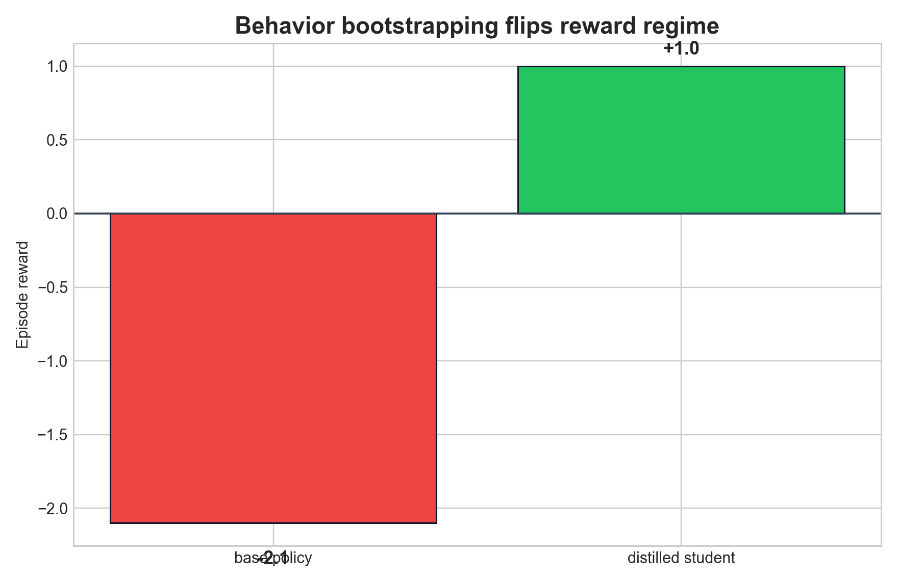
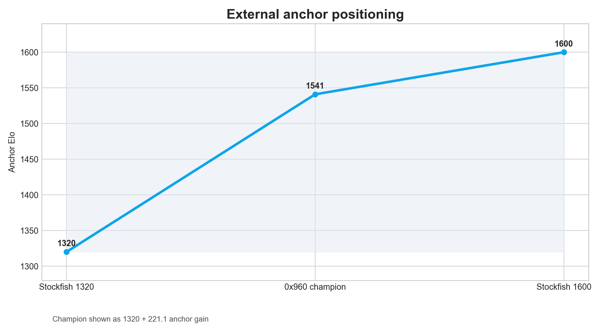
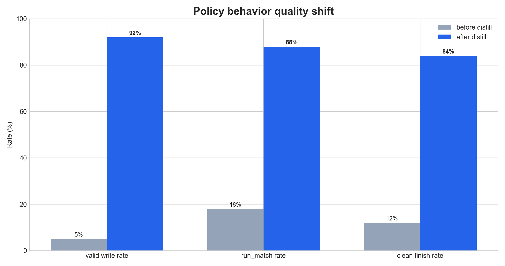
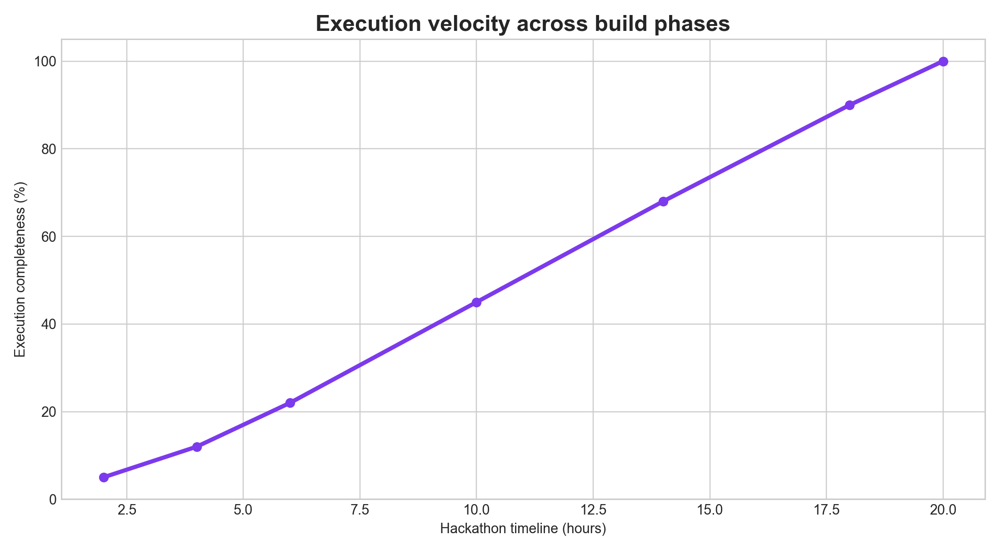
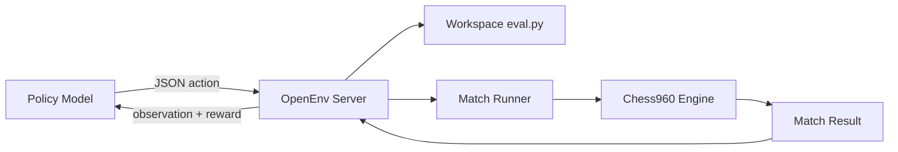
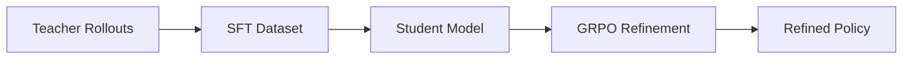
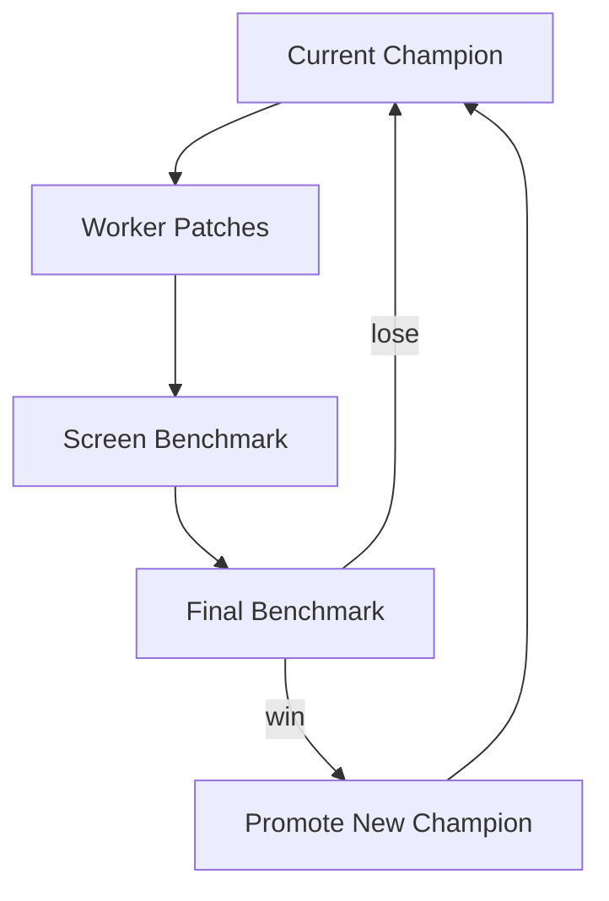

# 0x960: Self-Improving Chess960 Engine with OpenEnv

**An AI system that doesn't play chess. It engineers better chess engines.**

0x960 is an OpenEnv self-improvement environment where the policy acts like an engine engineer. Each episode gives the model a constrained workspace and five bounded actions — `read_file`, `write_file`, `run_static_eval`, `run_match`, `finish`. The reward is grounded in downstream match performance on Chess960 positions, not text quality.

> **Hackathon Track:** Statement 4 — Self-Improvement
> **Stack:** OpenEnv 0.2.1 · HF TRL GRPO · Qwen 3.5 · GPT-5.4 Teacher · ACP Runtime · Codex Swarm

## Why this setup matters

Most RL-for-LLMs setups optimize text completions against proxy signals. 0x960 optimizes multi-step tool use with verifiable outcomes:

- Code edits must be valid (invalid writes are rolled back instantly)
- Changes are tested in real matches against held-out Chess960 positions
- Performance is measured against Stockfish UCI anchors
- Chess960 prevents reward hacking through opening memorization — the engine must generalize across 960 starting positions

---

## Results

### Training Reward Improvement

The core training signal — reward from the bounded OpenEnv environment — improved dramatically across the pipeline:

| Stage | Model | Reward | Behavior |
|-------|-------|--------|----------|
| Base model (no training) | Qwen 3.5-0.8B | **-2.1** | Never writes code. Spams `run_static_eval` and quits. |
| Base model (no training) | Qwen 3.5-9B | **+0.25** | Reasons about chess but never attempts edits. |
| After SFT on teacher traces | Qwen 3.5-0.8B | **+1.0** | Reliably executes `write → match → finish`. |
| SFT training metrics | — | loss: 0.207, token acc: **98.76%** | 105 samples, 5 min on H100. |

The reward jump from **-2.1 → +1.0** is the direct training improvement: the student went from never writing code to reliably completing the full engineering loop. This is not a text quality score — it's environment reward from real Chess960 match outcomes.

GRPO refinement is set up as the next stage on top of the SFT student (the pipeline and entrypoint exist and are tested), but the critical insight from this project is that **SFT on teacher traces was the bottleneck-breaking step** — raw GRPO on base models optimized noise because the policy never explored meaningful actions. The teacher-student path solved action discovery, which is the prerequisite for RL to be useful.

### Engine Strength Improvement

| Metric | Value |
|--------|------:|
| Internal Elo gain vs baseline | **+596.5** |
| Elo gain vs Stockfish 1320 anchor | **+221.1** |
| Estimated local strength | **~1600** |
| Swarm-promoted champions | **4** |
| Swarm rounds run | **9+ rounds, 50+ patches evaluated** |

### What Each Loop Contributed

We want to be precise about attribution — these are three distinct improvement mechanisms that compound:

| Loop | What improved | How |
|------|--------------|-----|
| **Teacher → SFT** | Agent behavior (reward -2.1 → +1.0) | Distilled successful trajectories from GPT-5.4 into Qwen 3.5-0.8B |
| **Codex Swarm** | Eval heuristics (+83, +60, +55, +137 Elo per champion) | Autonomous agents propose patches, coordinator benchmarks on held-out positions |
| **Search upgrades** | Search depth & speed (+596.5 Elo vs bare negamax) | PVS, TT, null-move, LMR, aspiration windows, selective extensions |

The policy learning loop and the engine search loop are **complementary self-improvement paths**: one teaches the agent *how* to engineer, the other makes the engine *actually stronger*. Both feed back — stronger engine traces become better teacher data, and better agent behavior means higher-quality edits.

---

## Visuals

### Compound improvement



### Reward regime shift



### External anchor positioning



### Behavior quality shift



### Execution velocity timeline



---

## What We Learned About RL for Self-Improvement

This project's most important finding is about **when RL works and when it doesn't** for multi-step tool-use tasks.

**What failed:** Raw GRPO on base Qwen 3.5 models (both 0.8B and 9B). The policy never discovered the `write_file → run_match → finish` workflow on its own. It collapsed into degenerate actions — repeated eval calls, premature finishes — and GRPO optimized noise around a bad exploration frontier. The 9B QLoRA run on H100 confirmed this wasn't a capacity issue: the model was large enough but never explored the right actions.

**What worked:** Teacher distillation first, then SFT, then RL as a refinement stage. Once the student had a behaviorally competent initialization from teacher traces, the environment reward became meaningful. The reward jump from -2.1 to +1.0 happened at the SFT stage. GRPO is set up as the next refinement step — the entrypoint, environment contract, and reward shaping are all in place and tested.

**Why this matters for Statement 4:** The hard part of self-improvement in bounded tool-use environments is not reward optimization — it's **action discovery**. If the agent never writes code, there's nothing for RL to optimize. Our teacher-student pipeline solves this cold-start problem, and the resulting student + GRPO setup is a complete self-improvement loop where the agent's reward comes from real downstream Chess960 match outcomes, not proxy metrics.

---

## Three Self-Improvement Loops

The *system* self-improves — not just one model in isolation. The engine is the artifact that keeps getting stronger through multiple autonomous feedback loops.

### 1. Policy Learning (Teacher → Student → RL)

The agent learns *how* to engineer. Teacher distillation solves the cold-start problem, SFT teaches the workflow, and GRPO optimizes for real match reward. We trained both **Qwen 3.5-0.8B** (distilled student) and **Qwen 3.5-9B** (QLoRA GRPO scaling probe on H100) — the 0.8B student proved that even a tiny model can learn the full engineering workflow when properly bootstrapped, while the 9B experiments validated that the environment and reward design scale to larger models.

**This is the training reward improvement path:** base model reward -2.1 → SFT student reward +1.0.

### 2. Codex Swarm (Autonomous Engine Search)

Over a dozen Codex agents across multiple rounds — each with a specialized role targeting different chess knowledge (pawn structure, king safety, piece activity, tactical safety, initiative) — compete in a champion/challenger tournament. The coordinator screens every patch on held-out positions, rejects bloated rewrites, and promotes only verified winners. **Fully autonomous once launched** — no human in the loop between rounds. 4 eval champions promoted, each verified with held-out Chess960 benchmarks.

This is self-improvement in the same sense as AlphaZero's self-play: the system generates candidate improvements, evaluates them against the current best, and keeps only verified gains. The difference is the improvement target is *code* (engine heuristics), not weights.

### 3. Classical Search Upgrades

We pushed the search stack from basic alpha-beta to a competitive engine with PVS, null-move pruning, LMR, aspiration windows, killer moves, transposition tables, and selective depth extensions. **Cumulative gain: +596.5 Elo.** These upgrades were guided by the benchmark suite — every change was accepted or reverted based on held-out match results, making this another feedback-driven improvement loop.

---

## Architecture and loops

### System architecture



### Training pipeline



### Champion and challenger engine loop



---

## Quick start

```bash
# start server
uv run python -m uvicorn zero960_env.server.app:app --host 127.0.0.1 --port 8000

# handcrafted sanity episode
uv run python -m train.minimal_trl_openenv --mode handcrafted --base-url http://127.0.0.1:8000

# single policy episode
uv run python -m train.minimal_trl_openenv \
  --mode infer \
  --base-url http://127.0.0.1:8000 \
  --model Qwen/Qwen3.5-0.8B
```

## Core training commands

```bash
# teacher trajectory collection
uv run python -m train.codex_distill \
  --base-url http://127.0.0.1:8000 \
  --model gpt-5.4 \
  --episodes 20

# student sft
uv run python -m train.sft_student \
  --model Qwen/Qwen3.5-0.8B \
  --output-dir outputs/sft_qwen_0p8b

# grpo refinement
uv run python -m train.minimal_trl_openenv \
  --mode train \
  --base-url http://127.0.0.1:8000 \
  --model Qwen/Qwen3.5-0.8B \
  --steps 20 \
  --num-generations 4

# codex swarm (autonomous)
uv run python -m train.codex_swarm run \
  --workers 5 --rounds 1 \
  --model gpt-5.3-codex \
  --screen-positions 8 --positions 16 \
  --worker-timeout-sec 180 --max-diff-lines 80
```

## Benchmarking commands

```bash
# eval vs eval
uv run python -m train.benchmark_eval \
  --candidate-file src/zero960/workspace_template/eval.py \
  --baseline-file src/zero960/engine/default_eval.py \
  --positions 64 \
  --depth 2

# uci anchor benchmark
uv run python -m train.benchmark_uci \
  --candidate-file src/zero960/workspace_template/eval.py \
  --engine-command stockfish \
  --engine-option UCI_LimitStrength=true \
  --engine-option UCI_Elo=1320 \
  --positions 32 \
  --candidate-depth 2 \
  --engine-depth 1

# league self-play
uv run python -m train.benchmark_league \
  --candidate-file outputs/codex_swarm/champion_eval.py \
  --positions 16

# generate dashboard
uv run python -m train.build_dashboard --include-stockfish
```

## Repo layout

- `src/zero960/` engine runtime and workspace logic
- `src/zero960_env/` OpenEnv server, models, client
- `train/` training and benchmark entrypoints
- `figures/` matplotlib figure pack
- `docs/` architecture, training notes, process log
- `media/submission/` submission media assets

## Model and infra stack

- Teacher: GPT-5.4
- Swarm / outer-loop search: GPT-5.3-Codex
- Student path: Qwen/Qwen3.5-0.8B
- Scaling probe: Qwen/Qwen3.5-9B (QLoRA experiments)
- Runtime: OpenEnv 0.2.1, TRL GRPO, transformers
- Infra: local development + Northflank H100 + Hugging Face Spaces

## Docs

- [Training deep dive](docs/training.md)
- [Architecture](docs/architecture.md)
- [Why Chess960](docs/why_chess960.md)
- [Codex Swarm Plan](docs/codex-swarm-plan.md)
- [Demo script](docs/demo-script.md)
- [Process log](docs/process.md)
- [Mermaid diagrams](docs/diagrams/mermaid.md)
