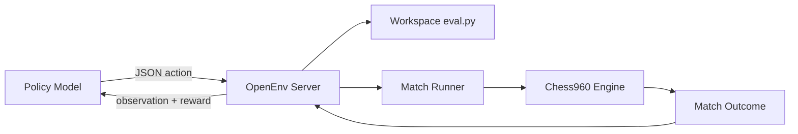
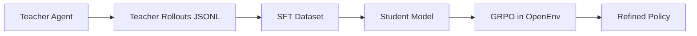
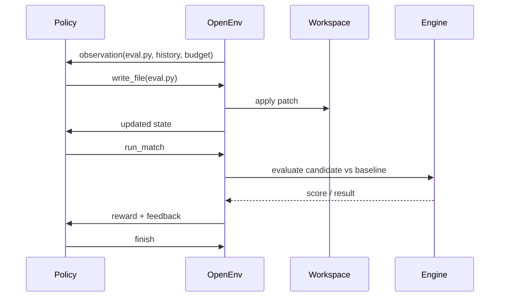
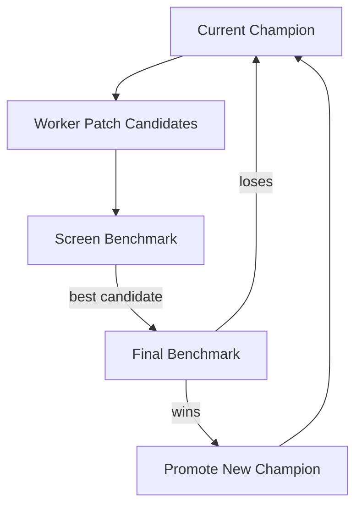

# Mermaid Diagrams

## 1) System architecture

```mermaid
flowchart LR
    A[Policy Model] -->|JSON action| B[OpenEnv Server]
    B --> C[Workspace eval.py]
    B --> D[Match Runner]
    D --> E[Chess960 Engine]
    E --> F[Match Outcome]
    F --> B
    B -->|observation + reward| A
```

## 2) Training pipeline

```mermaid
flowchart LR
    T[Teacher Agent] --> R[Teacher Rollouts JSONL]
    R --> S[SFT Dataset]
    S --> M[Student Model]
    M --> G[GRPO in OpenEnv]
    G --> C[Refined Policy]
```

## 3) Agent action loop

```mermaid
sequenceDiagram
    participant P as Policy
    participant O as OpenEnv
    participant W as Workspace
    participant E as Engine

    O->>P: observation(eval.py, history, budget)
    P->>O: write_file(eval.py)
    O->>W: apply patch
    O->>P: updated state
    P->>O: run_match
    O->>E: evaluate candidate vs baseline
    E-->>O: score / result
    O->>P: reward + feedback
    P->>O: finish
```

## 4) Champion/challenger loop

```mermaid
flowchart TD
    A[Current Champion] --> B[Worker Patch Candidates]
    B --> C[Screen Benchmark]
    C -->|best candidate| D[Final Benchmark]
    D -->|wins| E[Promote New Champion]
    D -->|loses| A
    E --> A
```
